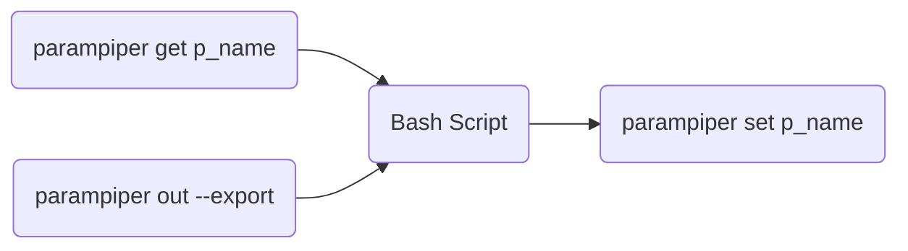
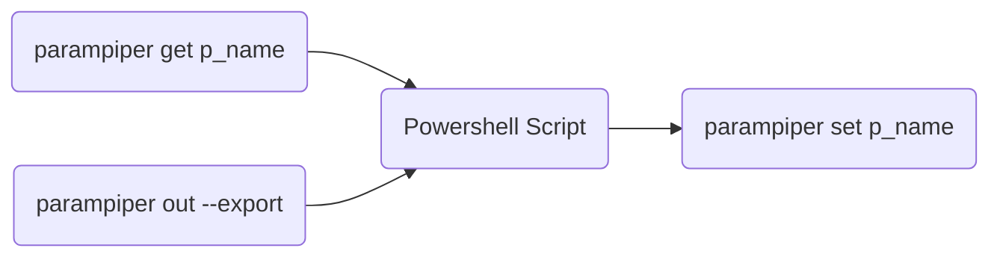
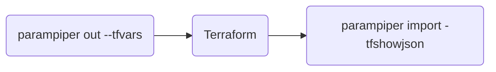

# parampiper

parampiper is a tool for manage parameters across between systems/environments. 

## Features 

- works on a simple json file. 
- support several backends (local file, azure blob)
- 
<!-- 
## Bash Script 

## Powershell Script 

## Terraform

## Bicep

TBD -->