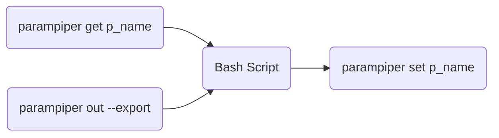
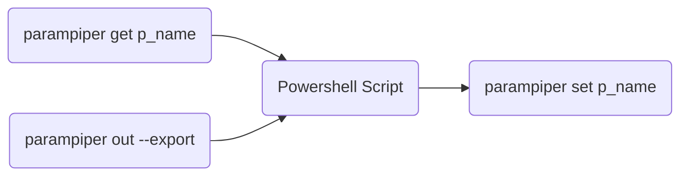
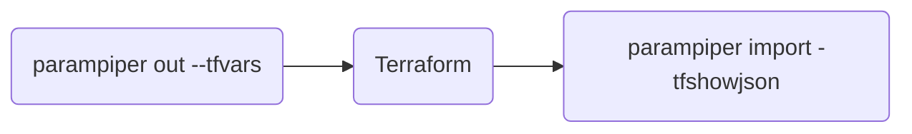

# parampiper

parampiper is a tool for manage parameters across between systems/environments.

## Bash Script 

```mermaid
flowchart LR

X(parampiper get p_name)--> A(Bash Script) -->B(parampiper set p_name)
Y(parampiper out --export) --> A
%% B --> C{Decision}
%% C -->|One| D[Result 1]
%% C -->|Two| E[Result 2]
%% X(parampiper get p_name <a href='http://google.com'>link</a>)--> A(Bash Script) -->B(parampiper set p_name)
```

## Powershell Script 

```mermaid
flowchart LR

X(parampiper get p_name)--> A(Powershell Script) -->B(parampiper set p_name)
Y(parampiper out --export) --> A
```

## Terraform

```mermaid
flowchart LR
X(parampiper out --tfvars)--> A(Terraform) -->B(parampiper import -tfshowjson)

```

## Bicep

TBD