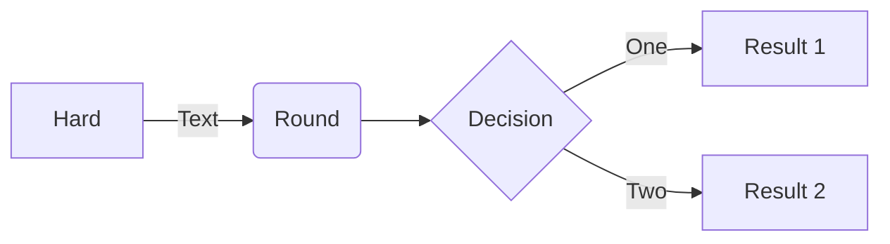
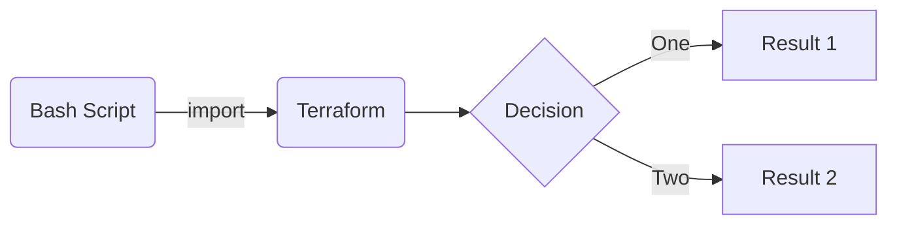

# parampiper

```mermaid
flowchart LR

A[Hard] -->|Text| B(Round)
B --> C{Decision}
C -->|One| D[Result 1]
C -->|Two| E[Result 2]
```

```mermaid
flowchart LR

A(Bash Script) -->|import| B(Terraform)
B --> C{Decision}
C -->|One| D[Result 1]
C -->|Two| E[Result 2]
```